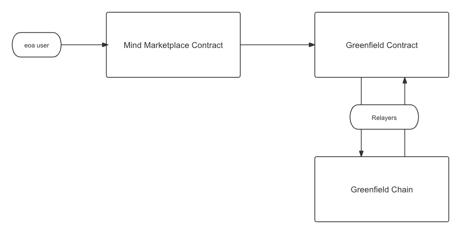

# Mind Marketplace Contract

Mind marketplace is a marketplace protocol for safely and efficiently buying and selling data uploaded in [Greenfield](https://github.com/bnb-chain/greenfield).

## Features
**Create Space**: Create a collection to sell your work.
**List Objects**: List your artwork uploaded on Greenfield to sell.
**Buy Objects**: Buy artworks and get download access.

## Environment Support

- BNB Greenfield Mainnet
- BNB Greenfield Testnet

## Technical Design

### Architecture Diagram

<p align="center">
    
</p>

### Workflow
**Create Space**: create a bucket for listing artworks by sending a greenfield cross-chain transaction
**List Objects**: create a group and create a policy to bind the group and object for listing by sending two greenfield cross-chain transactions
**Buy Objects**: add buyer into the group by sending a greenfield cross-chain transaction

## Install

To install dependencies:

```bash
git clone --recurse-submodules https://github.com/bnb-chain/mind-marketplace-contract.git && cd mind-marketplace-contract
yarn install
forge install
```

## Deploy

1. Copy `.env.example` and setup `OP_PRIVATE_KEY` and `OWNER_PRIVATE_KEY` in `.env`.

```bash
cp .env.example .env
```

2. Deploy with hardhat.

```bash
npx hardhat run scripts/1-deploy.ts --network bsc-testnet 
```

## Documentation

| Description                                                                                                  |
| ------------------------------------------------------------------------------------------------------------ |
| [BNB greenfield official website](https://greenfield.bnbchain.org/en)                                        |
| [Guide to BNB Greenfield](https://docs.bnbchain.org/greenfield-docs/docs/guide/home)                         |
| [Discord of BNB Greenfield](https://discord.gg/bnbchain)                                                     |
| [Forum of bnbchain](https://forum.bnbchain.org/)                                                             |
| [Guide to BNB Greenfield](https://docs.bnbchain.org/greenfield-docs/docs/guide/home)                         |
